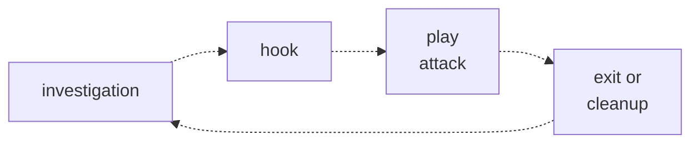

# Penetration test simple toolbox
current folder contains simplest tools for starting work in incognito mode.  

## Links
* [cheat sheet for pen testing](https://github.com/cherkavi/cheat-sheet/blob/master/pentest.md)

## Fishing loop

* investigaion 
  > understand or find the victim
* hook
  > attempt to hook up after investigation
* play attack
  > execute the "test"
* exit and cleanup 
  > try to make victim not guilty to use this channel again 